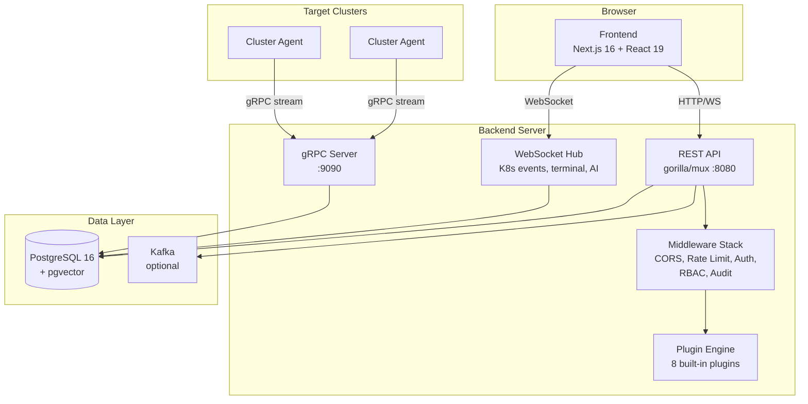
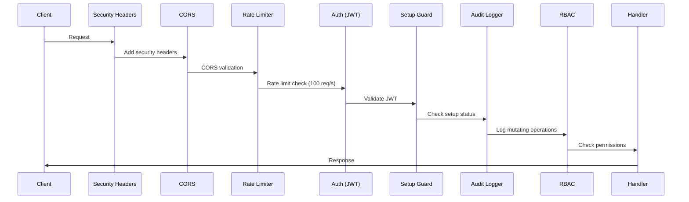
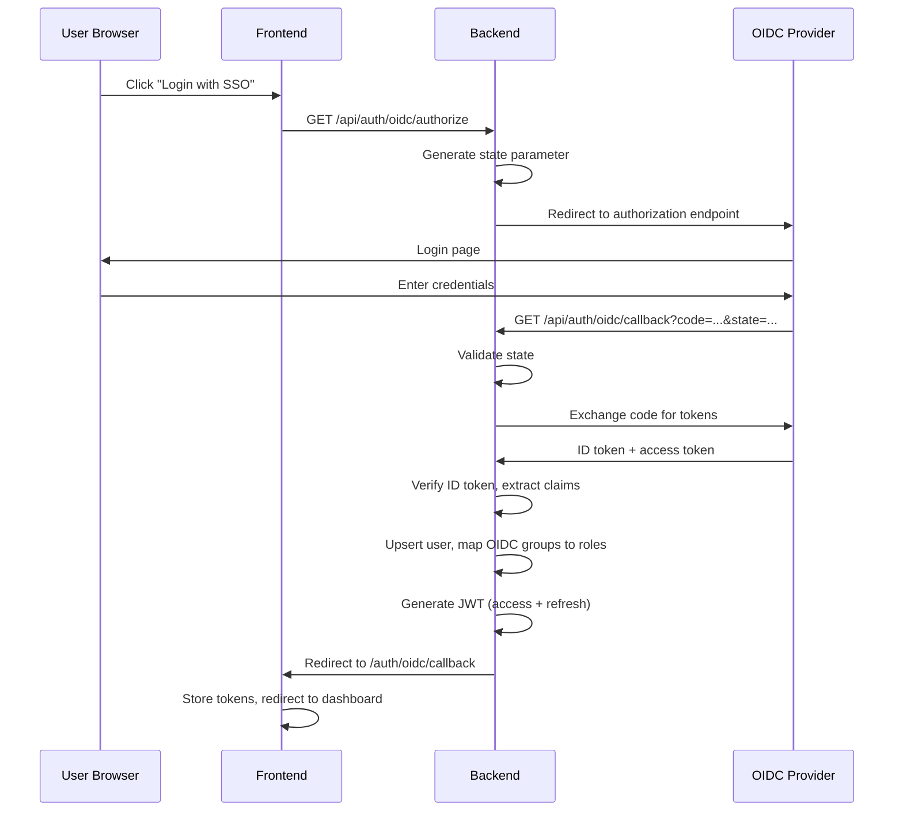
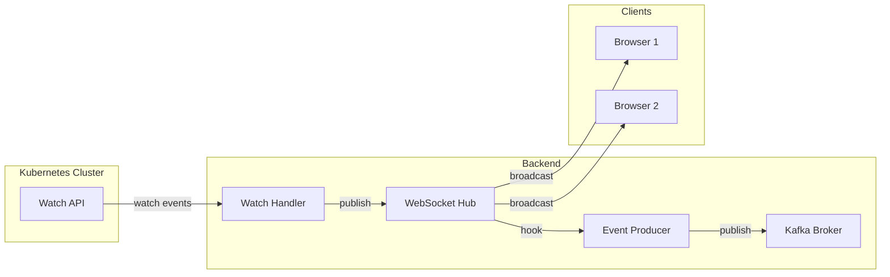
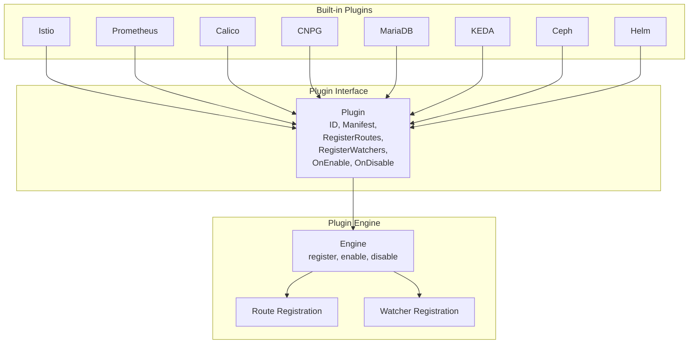

# Architecture

## System Overview

Argus is a multi-cluster Kubernetes dashboard with a plugin-based architecture. The system consists of a Go backend, a Next.js frontend, PostgreSQL with pgvector, an optional Kafka message broker, and lightweight gRPC agents deployed into target clusters.

## Request Flow

Every HTTP request passes through a layered middleware stack:

**Middleware order (outermost to innermost):**

1. **Security Headers** -- X-Frame-Options: DENY, HSTS, CSP, X-Content-Type-Options
2. **CORS** -- Validates `Origin` against `ALLOWED_ORIGINS`
3. **Rate Limiter** -- 100 req/s per IP (burst 200); auth routes: 10 req/s (burst 20)
4. **Auth** -- Validates JWT from `Authorization: Bearer` header
5. **Setup Guard** -- Returns 503 if initial setup is not completed
6. **Audit** -- Logs all POST/PUT/DELETE operations to `audit_logs` table
7. **Handler** -- Business logic

## OIDC Authentication Flow

## WebSocket Event Flow

The WebSocket Hub is a pub/sub system. When a Kubernetes watch event fires (ADDED, MODIFIED, DELETED), it is:
1. Published to the Hub for real-time delivery to connected browsers
2. Hooked by the EventProducer for async notification processing via Kafka

## Plugin System Architecture

Each plugin provides:
- **manifest.json** -- Metadata, routes, watchers, frontend navigation
- **Go implementation** -- Implements the `Plugin` interface
- **Frontend components** -- React pages and dashboard widgets

Plugins are registered at startup in `main.go` and can be enabled/disabled per cluster at runtime via the API.

## Database Schema (Key Tables)

| Table | Purpose |
|-------|---------|
| `users` | User accounts (local + OIDC) |
| `refresh_tokens` | JWT refresh token tracking and revocation |
| `clusters` | Registered Kubernetes clusters |
| `roles` | RBAC role definitions |
| `role_permissions` | Permissions attached to roles |
| `user_roles` | User-role assignments (scoped to cluster/namespace) |
| `oidc_role_mappings` | OIDC group to RBAC role mappings |
| `settings` | Key-value application settings (OIDC config, setup status) |
| `audit_logs` | Audit trail for all mutating API operations |
| `notifications` | Stored notifications per user |
| `notification_preferences` | Per-user notification preferences |
| `notification_channels` | Configured notification channels (Slack, email, etc.) |
| `agent_tokens` | Agent registration tokens |
| `plugin_config` | Per-cluster plugin enable/disable state |
| `ai_config` | AI provider configuration |
| `ai_conversations` | AI chat conversation history |
| `ai_embeddings` | pgvector embeddings for RAG |

## Component Technology Stack

| Layer | Technology |
|-------|-----------|
| Frontend | Next.js 16, React 19, TypeScript, Tailwind CSS 4, shadcn/ui, Zustand, xterm.js |
| Backend | Go 1.25, gorilla/mux, gorilla/websocket, pgx/v5, golang-jwt/v5, client-go, gRPC |
| Database | PostgreSQL 16 + pgvector 0.8.0 |
| Agent | Go, gRPC bidirectional streaming, in-cluster ServiceAccount |
| Notifications | Kafka (async) or in-memory broker (dev), SMTP, Slack, Teams, Telegram, Webhook |
| AI | Claude / OpenAI / Ollama, RAG with pgvector, tool-use with confirmation |
| CI/CD | GitHub Actions, Jenkins, Docker, Helm |
